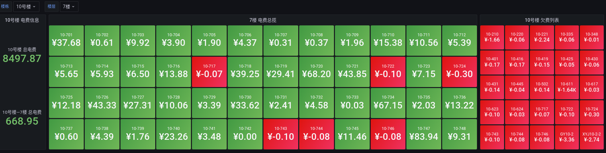

# HNIU 校园一卡通API


_该脚本仅适用于 **HNIU** 校园一卡通服务_   
基于 **Python FastAPI** HNIU 校园一卡通 API 后端

## 程序功能

- 获取用户信息
- 获取各个寝室电费
- [influxdb2 数据统计](/foo/influxdb.py)
- [grafana 数据展示](docs/grafana.json)


## 如何使用

下载项目

```shell
git clone https://github.com/Ayouuuu/hniu-card-api.git
cd hniu-card-api
```

安装依赖

```shell
pip install -r requirements.txt
```

运行程序

```shell
python -m uvicorn main:app --reload
```

如果无法运行, 请安装 `uvicorn` 依赖

```shell
# 以下选择一种即可
pip install uvicorn
pip install uvicorn[standard]
```

## 接口使用

文档地址

```text
http://127.0.0.1:8000/docs
http://127.0.0.1:8000/redoc
```

现在已支持自动识别验证码(ddddocr),可采用 `/login` 接口进行登陆  
~~登陆 [一卡通](http://10.14.0.124/zytk35portal/Cardholder/Cardholder.aspx) 按 F12 进入网页控制台，点击 Network(网络) 找到 `Cardholder.aspx` 文件 `Headers->Request Headers->Cookie` 然后复制~~

## 楼栋对照表
其实每一栋楼都是有自己的名称以及别名的...详细可以参考[校园平面图](https://www.hniu.cn/xysh/xypmt.htm)

|   ID   | 楼栋名  |   别名    |
|:------:|:----:|:-------:|
| 001005 | 10号楼 | 北八（北十）  
| 001004 | 8号楼  |   北七    
| 001003 | 7号楼  |   北六    
| 001002 | 6号楼  | 北六（教师楼） 
| 001001 | 5号楼  |   北五    |
| 001006 | 23号楼 |   南七    |
| 001007 | 24号楼 |   南六    |
| 001008 | 27号楼 |   南五    |
| 001009 | 28号楼 |   南四    |
| 001010 | 29号楼 |   南三    |
| 001011 | 30号楼 |   南二    |
| 001012 | 31号楼 |   南一    |